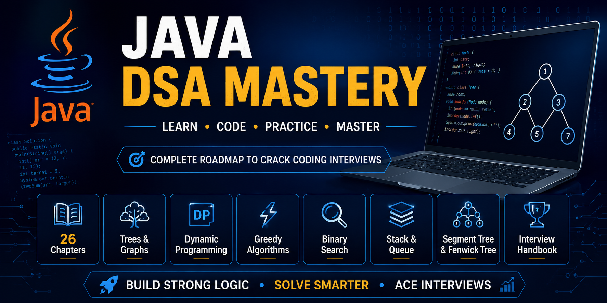
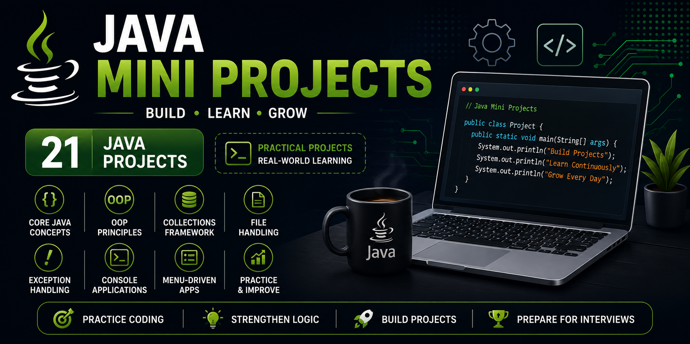
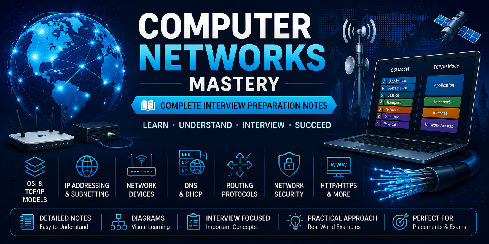
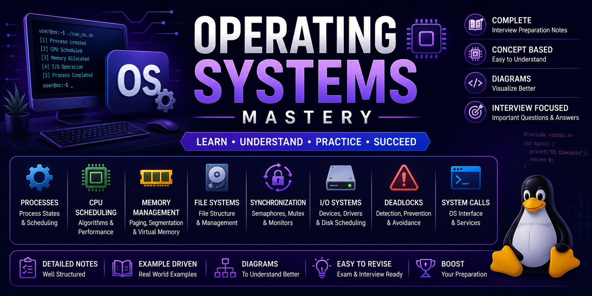
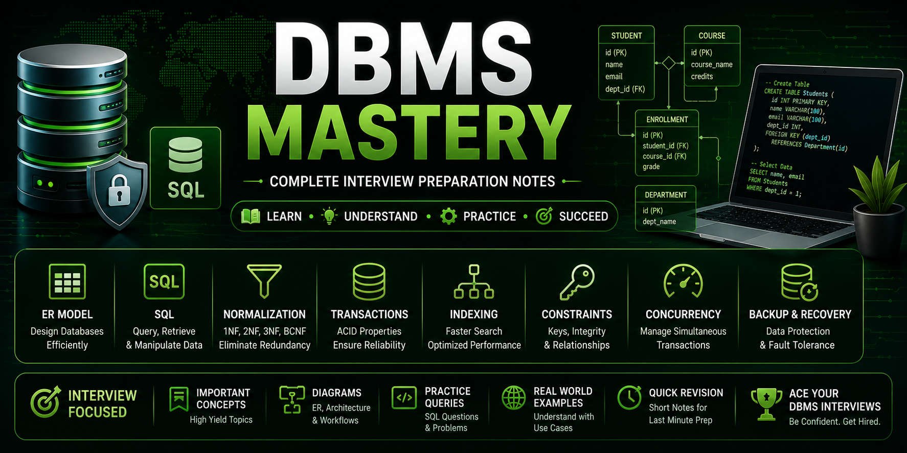

<h1 align="center">Hi 👋, I'm Sai Kumar Kadiri</h1>

<h3 align="center">
Aspiring Software Engineer | Java Developer | SDE-1 Preparation | Full Stack Developer
</h3>

  

  
  

---

# 👨‍💻 About Me

🎓 **B.Tech Graduate (2023)**

💻 Passionate **Java Developer** with a strong interest in building scalable software, solving Data Structures & Algorithms problems, and strengthening Computer Science fundamentals.

🚀 Currently preparing for **Software Development Engineer (SDE-1)** opportunities while continuously improving my coding, system design, and software engineering skills.

---

# 🎯 Current Focus

- ☕ Mastering Core Java & Advanced Java
- 📚 Solving Data Structures & Algorithms daily
- 🏗️ Building Java & Spring Boot Projects
- 🌐 Strengthening Computer Science Fundamentals
- 🤖 Learning GenAI Fundamentals
- 🎯 Preparing for Product-Based Company Interviews

---

# 🛠️ Tech Stack

## 👨‍💻 Programming Languages

---

## 🌐 Frontend

---

## ⚙️ Backend

---

## 🗄️ Database

---

## 🛠️ Tools & Platforms

---
# 🚀 Featured Repositories

These repositories represent my continuous journey toward becoming a Software Engineer and cover practical software development, interview preparation, and Computer Science fundamentals.

---

## ⭐ Java DSA Mastery

Comprehensive Java solutions covering:

- Arrays
- Strings
- Linked Lists
- Stacks & Queues
- Trees & BST
- Heaps
- Graphs
- Dynamic Programming
- Greedy Algorithms
- Backtracking
- Sliding Window
- Two Pointers

  

Java-DSA_Repository: https://github.com/kadirisaikumar3/Java-DSA-Mastery
---

## ☕ Java Mini Projects

A collection of **21 Java console applications** covering:

- Core Java
- Object-Oriented Programming
- Collections Framework
- File Handling
- Business Logic
- Menu-Driven Applications

  

Java-Mini-Projects Repository: https://github.com/kadirisaikumar3/Java-Mini-Projects

---

## 🌐 Computer Networks Mastery

Interview-focused notes covering:

- OSI Model
- TCP/IP
- DNS
- HTTP & HTTPS
- TCP & UDP
- Routing & Switching
- DHCP
- ARP
- Network Security

  

Computer-Networks-Mastery Repository: https://github.com/kadirisaikumar3/Computer-Networks-Mastery

---

## 💻 Operating Systems Mastery

Topics include:

- Processes & Threads
- CPU Scheduling
- Deadlocks
- Synchronization
- Memory Management
- Paging
- Virtual Memory
- File Systems

  

Operating-Systems-Mastery Repository: https://github.com/kadirisaikumar3/Operating-Systems-Mastery

---

## 🗄️ DBMS Mastery

Interview preparation covering:

- ER Model
- Normalization
- SQL
- Joins
- Transactions
- Indexing
- Concurrency
- ACID Properties

  

DBMS-Mastery Repository: https://github.com/kadirisaikumar3/DBMS-Mastery

---

# 📊 GitHub Activity

# 📈 Contribution Graph

---

# 📌 Repository Highlights

- ☕ Built and documented **21 Java Mini Projects**
- 📚 Solving Data Structures & Algorithms using Java
- 🌐 Comprehensive Computer Networks interview notes
- 💻 Operating Systems interview preparation
- 🗄️ Database Management Systems (DBMS) interview preparation
- 🚀 Developed full-stack web applications using React, Node.js, Express, and MongoDB
- 📈 Consistently building projects and improving software engineering skills

---
# 📚 Currently Learning

I'm continuously expanding my knowledge in software engineering and currently focusing on:

- ☕ Advanced Java
- 🌱 Spring Boot
- 📚 Advanced Data Structures & Algorithms
- 🏗️ System Design Fundamentals
- ⚙️ Low-Level Design (LLD)
- 🤖 Generative AI Fundamentals
- ☁️ Backend Development
- 🚀 Software Engineering Best Practices

---

# 🎯 2026 Goals

- ✅ Solve 500+ Data Structures & Algorithms problems
- ✅ Build production-ready Spring Boot projects
- ✅ Strengthen Core Computer Science fundamentals
- ✅ Master Java Backend Development
- ✅ Contribute to Open Source
- ✅ Secure a Software Development Engineer (SDE-1) role

---

# 🌍 Connect With Me

---

# 🌐 Portfolio

Explore my portfolio to learn more about my projects and skills.

🔗 **Portfolio:** https://kadirisaikumar3.github.io/

---

# 🧩 Coding Profiles

- 💻 GitHub: https://github.com/kadirisaikumar3
- 🟨 LeetCode: https://leetcode.com/u/Saikumar_369/
- 💼 LinkedIn: https://www.linkedin.com/in/saikumarkadiri/

---

# 💼 Open to Opportunities

I'm actively seeking opportunities for:

- Software Engineer (SDE-1)
- Java Developer
- Backend Developer
- Full Stack Developer
- Graduate Software Engineer

I'm always excited to collaborate on interesting projects and connect with fellow developers.

---

# ⭐ Thank You for Visiting

Thank you for taking the time to visit my GitHub profile.

If you find my projects helpful, consider giving them a ⭐.

Let's connect, learn, and build amazing software together!

---

### 🚀 Keep Learning • Keep Building • Keep Growing 🚀

 	